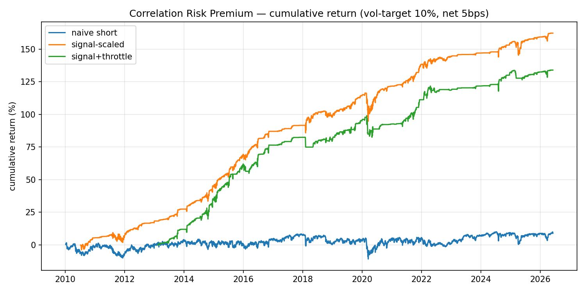
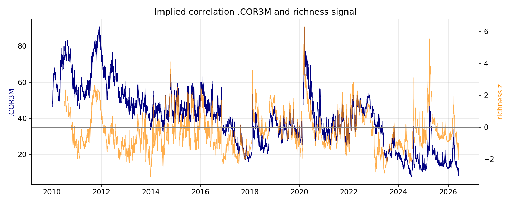
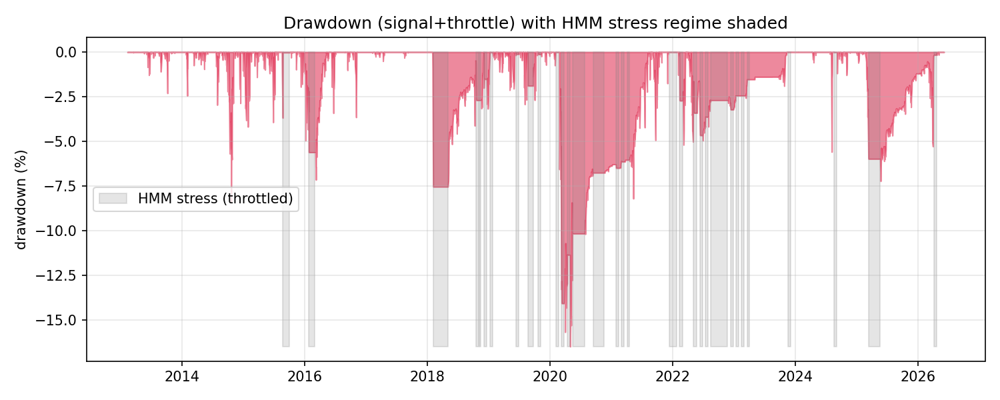
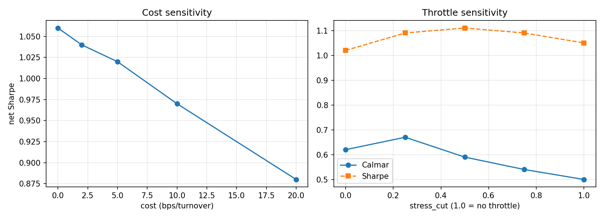

# Correlation Risk Premium Engine — Strategy Tearsheet

_Short the implied-correlation risk premium, sized by richness, with a walk-forward HMM regime
throttle. Net of 5 bps/turnover, displayed at 10% annualized vol. 2010–2026 (regime OOS 2013+)._

## Headline

| Variant | Sharpe | AnnRet % | MaxDD % | Calmar |
|---|---|---|---|---|
| Naive constant short | 0.05 | 0.5 | −19.3 | 0.03 |
| Signal-scaled (sell when rich) | **1.03** | 10.3 | −21.5 | 0.48 |
| Signal + HMM throttle | 1.02 | 10.2 | **−16.5** | **0.62** |

**Bootstrap (block, signal+throttle):** Sharpe 1.02, 95% CI **[0.59, 1.48]**, P(Sharpe>0) = 1.00.

## The economic result (this stands even if the alpha is thin)

- **Convergent validity:** corr(.COR3M implied, realized 9-sector correlation, 63d) = **+0.808**.
  The CBOE implied-correlation index and the thesis' realized correlation measure the same latent
  object — this is the bridge from the MSc mémoire (realized CSI) to a tradable instrument.
- **The premium is real but conditional:** a constant short earns ~0 (the secular decline in
  correlation is eaten by crashes). Sizing by richness (sell only when implied correlation is rich,
  `size = clip(0.5 + 0.5·z, 0, 1.5)`) turns it into a Sharpe ~1.0 strategy.
- **It is short a crash:** correlation gaps to 1 in stress; the strategy is structurally
  negatively-skewed. This is *why* the regime layer is load-bearing, not cosmetic.

## The regime throttle — honest assessment

A walk-forward Gaussian HMM (3 states; expanding quarterly refit; causal Viterbi decode; economic
relabelling; 10-day hysteresis) on [SPY realized vol, COR3M, 5-day COR change, term slope] flags a
"stress" state (19% of days) and throttles gross.

- **Full sample:** holds Sharpe (1.05→1.02), cuts MaxDD (−21.5%→−16.5%), lifts Calmar (0.50→0.62).
- **It is NOT a free lunch:** by regime, the un-throttled book is actually *positive* in stress
  (+13%/yr) — the throttle trades return for a smaller tail (tail insurance), it does not avoid losses.
- **It is NOT a uniform crisis hedge** (see crisis table): it helps when stress is persistent
  (2011, 2022) and hurts when the gap is instantaneous (COVID — confirmed too late) or when it cuts a
  profitable reversion (2015). The aggregate worst-drawdown still improves.

**Sensitivity (direction is robust, not knife-edge):** every partial cut in 0.0–0.5 beats no-throttle
on Calmar; a partial cut (~0.25: Sharpe 1.09 / Calmar 0.67) dominates both extremes by preserving the
mean-reversion while capping the tail. We report the sensitivity rather than pin a single "optimal" cut
(that would be in-sample tuning).

## Cost & crisis robustness

| Cost (bps/turn) | 0 | 2 | 5 | 10 | 20 |
|---|---|---|---|---|---|
| Net Sharpe | 1.06 | 1.04 | 1.02 | 0.97 | 0.88 |

| Crisis | signal % | throttle % | Δ |
|---|---|---|---|
| EU debt 2011 | −1.1 | 0.0 | +1.1 |
| China/oil 2015 | 10.2 | 2.4 | −7.8 |
| Volmageddon 2018 | 4.0 | −7.5 | −11.5 |
| COVID 2020 | −10.0 | −11.8 | −1.8 |
| Rates 2022 | 3.2 | 7.8 | +4.5 |
| 2024–25 spikes | 9.0 | 6.5 | −2.6 |

## Honest limitations

1. `.COR3M` is an **index, not a directly tradable instrument**; P&L is the MtM of a short-correlation
   position (−Δ COR/100). Real implementation (dispersion via options) carries replication error.
2. **implied − realized is not a tradable spread** (corr of *changes* ≈ 0.17, cross-universe levels
   differ); only the COR index MtM is traded. Convergent validity justifies the *premium*, not a spread.
3. Today .COR3M = 12.2 = 1.9th percentile (record-low correlation) → the signal is correctly near-flat;
   the strategy is not "always short".
4. The throttle lags fast gaps; a faster signal (intraday/options) is unavailable on this data.
